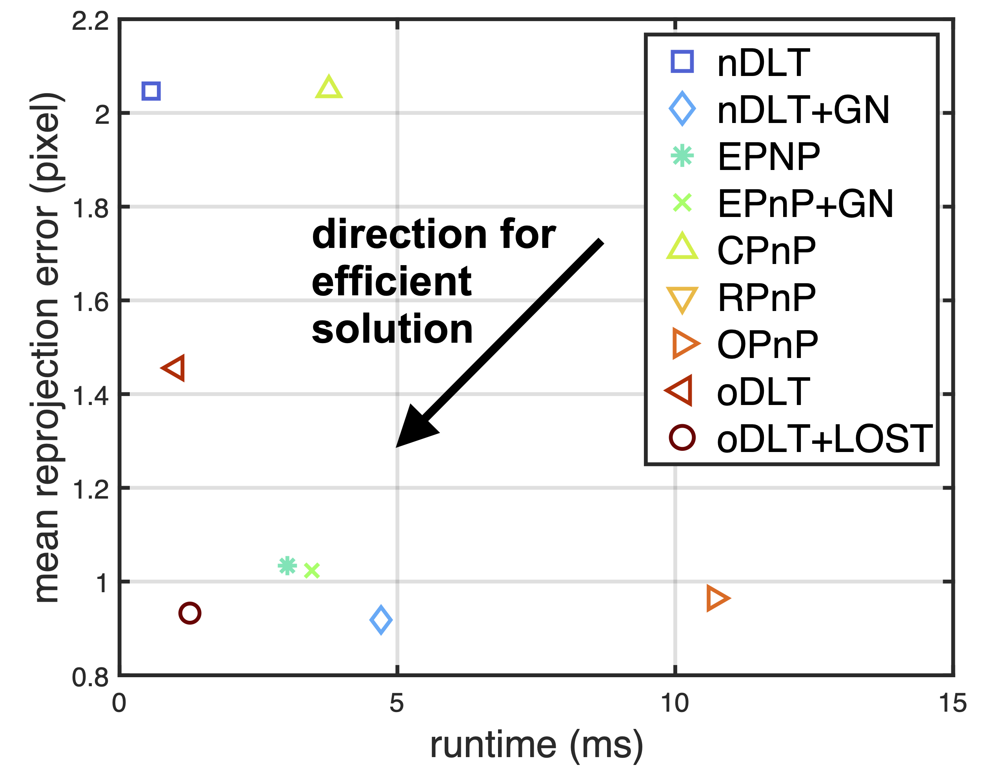

# oDLT: Optimal DLT-based Solutions for the Perspective-n-Point

This repo contains MATLAB implementations of the new optimal weighted DLT methods: `oDLT` and `oDLT+LOST`. Fast MATLAB standard DLT methods are also included. 
Our code is available in `PnP/oDLT`.

For more information on the underlying mathematics you may find the preprint at this link:

[Sébastien Henry and John A. Christian. Optimal DLT-based Solutions for the Perspective-n-Point (2024).](https://arxiv.org/abs/2410.14164)

If you use some of the code for your work, please cite:

      @misc{henry2024oDLT,
            title={Optimal DLT-based Solutions for the Perspective-n-Point}, 
            author={Sébastien Henry and John A. Christian},
            year={2024},
            eprint={2410.14164},
            archivePrefix={arXiv},
            primaryClass={cs.CV},
            url={https://arxiv.org/abs/2410.14164}, 
      }

Included Experiments
---
In `scripts`, you may find:
- The synthetic numerical experiments.
- The real-data experiments (Vesta and ETH). However, reproducing the real experiments requires downloading the datasets and ensuring the links are properly set.

For example, after running the ETH3D dataset, you will observe that `oDLT+LOST`offers a great performance between runtime and reprojection error:

